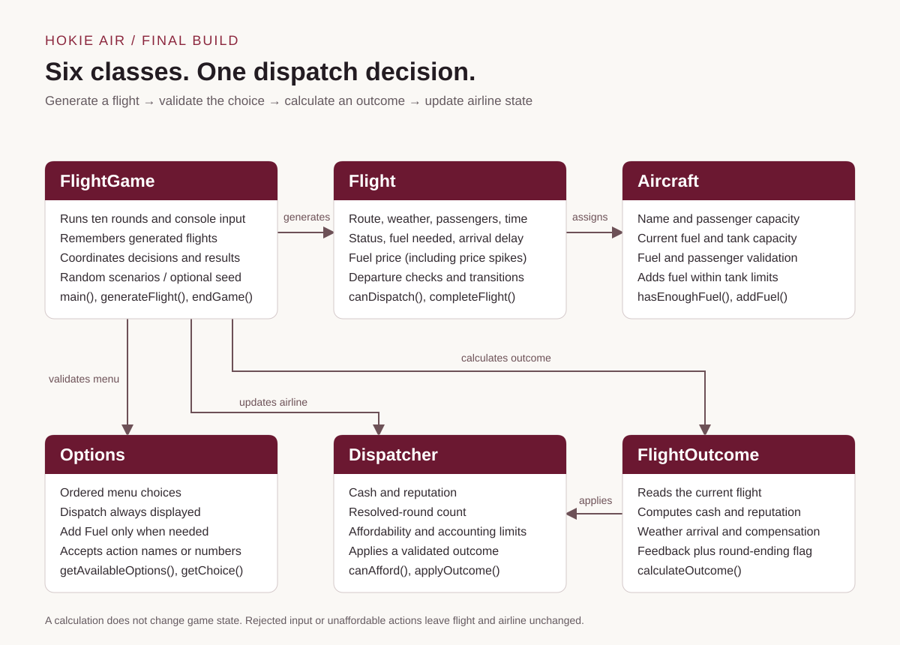

# Hokie Air: Cleared for Departure

A Java console strategy game for CS 2114, Fall 2026, Project 1. Manage ten flight-dispatch scenarios for Hokie Air while tracking cash and reputation.

**Team:** Nimai Garg, Nolan Ayodeji, Edward Wei, Sarah Beatty.

**Public repository:** https://github.com/nimai-garg/CS2114-Project-1

## Compile, run, and test

Use **JDK 17**. No Maven, Gradle, or network download is needed after cloning. The course-provided `lib/student.jar` is committed and includes the JUnit runner used by the tests.

On macOS or Linux, run these commands from the repository directory:

```sh
sh build.sh compile
sh build.sh run
sh build.sh test
```

The script uses `JAVA_HOME` when set, then checks common Java 17 installations on macOS, then uses Java from your terminal path. On this project's original Mac, it can find the JDK bundled with Eclipse. If it asks for JDK 17, set `JAVA_HOME` to your own JDK 17 installation; do not copy someone else's machine-specific path.

Equivalent manual commands, with JDK 17 on your terminal path:

```sh
mkdir -p bin
javac -Xlint:all -cp lib/student.jar -d bin *.java
java -cp bin FlightGame
java -cp "bin:lib/student.jar" org.junit.runner.JUnitCore AircraftTest DispatcherTest FlightTest FlightOutcomeTest OptionsTest FlightGameTest IntegrationTest WeatherDispatchTest StrategyTest FinalBuildTest
```

For Windows PowerShell, use `New-Item -ItemType Directory -Force bin` instead of `mkdir -p bin`, and use `"bin;lib/student.jar"` for the test classpath. The compile and game commands otherwise stay the same.

To build only the game without the test library:

```sh
javac -d bin Aircraft.java Flight.java Dispatcher.java FlightOutcome.java Options.java FlightGame.java
java -cp bin FlightGame
```

In VS Code, open `FlightGame.java` and select **Run** above `main`. The checked-in VS Code settings reference the original Mac's Eclipse JDK; on another computer, use **Java: Configure Java Runtime** to select your JDK 17 or use the terminal commands above.

The course test library may print Java 17 security-manager deprecation warnings. These warnings are from the library; the JUnit result appears at the end. Newer JDK versions are not supported by this course library.

## How to play

Enter the displayed number or the action name. Dispatch is always option 1. Type `Quit` to end early. Blank input, invalid names, invalid numbers, blocked departures, and unaffordable actions produce feedback without changing the flight or airline state.

| Action | Behavior |
|---|---|
| Dispatch | Requires enough fuel and passengers within capacity. Resolves the round as Completed, consumes flight fuel, and applies net revenue and reputation changes. |
| Add Fuel | Appears when fuel is insufficient. Buys exactly the deficit, rounded up to a whole-dollar cost. Does not end the round. |
| Delay | Resolves the round as Delayed. Cash stays unchanged; reputation decreases by 4. The same flight is not retried, and no other airline is involved. |
| Cancel | Resolves the round as Cancelled. Cash stays unchanged; reputation decreases by 12. |

The airline begins with **$10,000 and 100 reputation**. These are starting values, not a winning target. Reputation never falls below zero. After ten resolved rounds, the game shows cash, reputation, departure/delay/cancellation counts, and on-time/late arrival counts. There is no explicit win/loss threshold.

### Weather, fuel prices, and costs

- Clear or Sunny weather has an on-time arrival. Rain or Windy weather allows dispatch, with a 50% on-time chance; otherwise arrival is 15–90 minutes late.
- On-time dispatch earns `$150 × passengers − ($1,800 + $25 × flight minutes)` and adds 10 reputation.
- Late dispatch subtracts an additional `$50 × passengers + $15 × minutes late`, with a reputation loss of `5 + floor(minutes late / 10)`.
- Fuel normally costs **$1.50 per unit**. In 25% of generated scenarios, a price spike raises it to **$2.25 or $3.00**, with equal probability. The price stays fixed for that flight and is shown before purchasing.
- Displayed dispatch net revenue excludes fuel purchased separately. The actual calculated action must be affordable; there is no worst-case cash reserve requirement.
- Delay and Cancel both preserve cash; with the current requested rules, Delay has the smaller reputation penalty. Dispatch is the only action that can earn revenue or improve reputation. These are simplified game rules, not a simulation of real airline procedures.

## System diagram



[Open the diagram](docs/system-diagram.svg) · [Text version and design changes](docs/design.md)

## Scope and final build

The six original game classes are retained: `Aircraft`, `Flight`, `Dispatcher`, `FlightOutcome`, `Options`, and `FlightGame`.

The MVP includes valid generated scenarios, all four player decisions, persistent cash/reputation, ten-round completion, and recovery from bad input. Fuel-price spikes implement an original stretch goal. Weather arrival risk and financial previews are later requested extensions.

Crew availability was removed in the revised scope. Passenger satisfaction, maintenance issues, airport congestion, mechanical warnings, ticket-price selection, and intentional overbooking are not implemented. The removed partner-airline system, explicit winning target, and worst-case reserve requirement have not been restored.

## Tests and repeatable demo

The final build has **82 JUnit tests**. They cover normal and invalid inputs across key methods, financial/state consistency, all menu-problem combinations, both weather outcomes, fuel prices, scenario regeneration, 10,000 generated scenarios, full game completion, EOF, quitting, and the actual console loop. See the [method coverage checklist](docs/testing.md).

A repeatable demo:

```sh
sh build.sh demo
```

Enter `wrong` to show rejection, then `Dispatch` to complete the first flight, then `Quit`. The first flight arrives on time with this seed and those inputs. The next flight shows a fuel-price spike. This is the normal game using seed 2114, not a scripted substitute. For another repeatable run, use `sh build.sh run --seed 42`.

GitHub Actions compiles the code, runs every `*Test.java` class, and smoke-tests the console demo on pushes and pull requests.

## Repository organization

Unused introduction programs and the empty placeholder were removed by the team; their history remains in Git.

- Root: six game classes and all JUnit test classes.
- `lib/student.jar`: existing course test dependency.
- `docs/`: current diagram, design changes, and testing map.
- `.github/workflows/`: automated Java 17 checks.
- `bin/`: local compiled output, ignored by Git.

GenAI assisted integration, validation, test expansion, merge resolution, and documentation in this build. Team members should review and be ready to explain the code and the tradeoffs; the repository does not claim personal learning experiences on anyone's behalf.

## Submission still required

Repository preparation does not submit the assignment. Before your lab session, your group must:

- Open the public repository link in a private browser window yourselves and paste it into the Canvas submission comment.
- Create the slides from the supplied base deck, export PDF or PPTX, and upload one submission for the group.
- Rehearse an approximately ten-minute talk including the live demo, all four required parts, and at least one speaking role for every member.
- Cover the MVP/diagram/spec changes/stretch goals; working demo and bad input; scope-to-spec and spec-to-code reflections; and GenAI capabilities, successes, failures, and next-project ideas.

Slides and presentation work are deferred. Their design quality and the live explanation are graded separately; passing tests does not guarantee an Exceeds rating. Preserve the team's real commit history and continue making genuine contributions rather than manufacturing commits or authorship.
