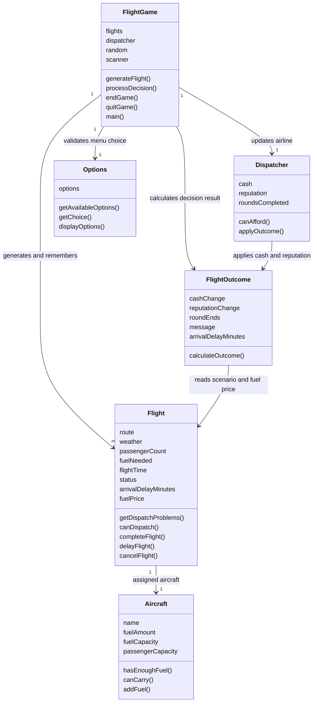

# Current design

## Flow

The game generates and stores a valid Flight with an Aircraft. Options produces an ordered menu. FlightGame validates input and checks departure conditions. FlightOutcome calculates a result without mutating the flight. FlightGame checks affordability and accounting limits before changing the flight and applying the outcome to Dispatcher. Refueling retains the current round; departure, delay, and cancellation resolve it. The console stops after ten resolved rounds or Quit/EOF.

## Changes from Deliverable 2

| Original design | Final implementation and reason |
|---|---|
| Bad weather prevents dispatch | Later user request permits a weather gamble: on-time or 15–90 minutes late. Fuel/capacity limits still block departure. |
| Available options depend on problems | Dispatch remains visible in every scenario, per the later request. Add Fuel appears only when needed. |
| General cash/reputation effects | Explicit operating-cost and compensation formulas make route duration, passenger load, and weather matter. |
| Delay changes status | Delay resolves the round with no cash change and −4 reputation. It does not reschedule the same flight. |
| Fixed scenario fields | Arrival lateness and fuel price were added to support requested weather behavior and the fuel-price stretch goal. |
| Random scenarios | Optional `--seed` supports repeatable demonstrations and debugging; normal play remains random. |
| Scenario regeneration | Invalid generated data is retried; 100 failed attempts terminate with an explanatory exception rather than an infinite loop. Valid built-in generation stays within the defined ranges. |

Crew availability remains removed. Passenger satisfaction and the other optional stretch ideas remain outside this build. There is no partner airline, winning target, or worst-case reserve requirement.

## Known simplifications

A generated flight uses its own aircraft rather than a persistent fleet. Delay and Cancel both preserve cash and finish the round; Delay is less damaging to reputation. A calculated unaffordable dispatch outcome is rejected without mutating flight/airline state. The random generator still advances, so repeating the same weather dispatch can draw a different outcome. This follows the current affordability behavior rather than simulating debt or restoring a worst-case reserve.

Some fields remain package-visible because the existing integration tests construct controlled scenarios by changing them. Constructors and public state-changing methods validate normal use. Production game code generates bounded scenarios.
